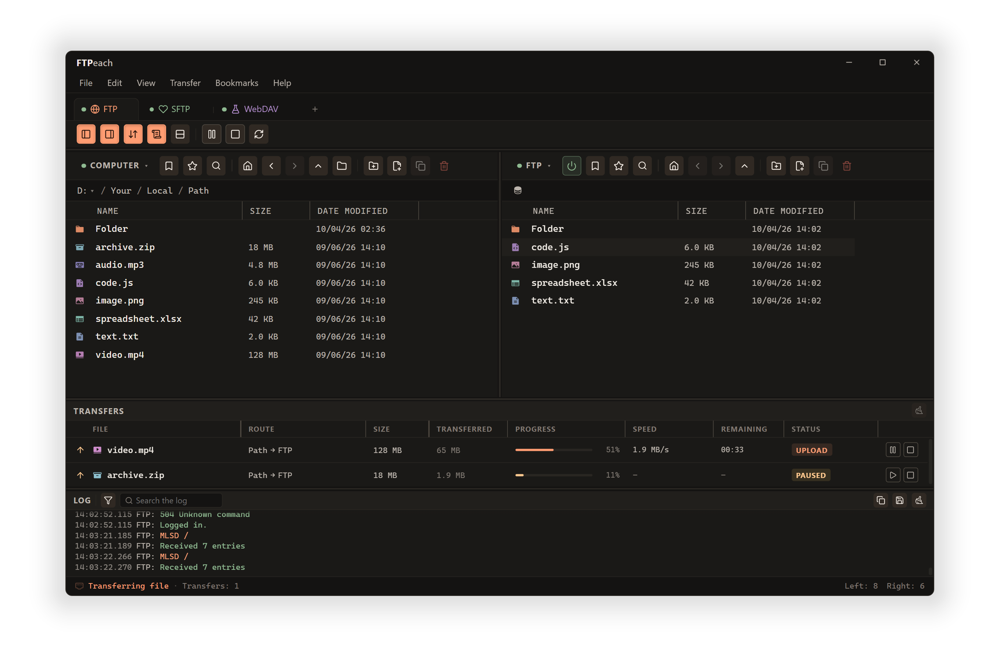

#  FTPeach

A desktop file transfer client for Windows.

[](https://github.com/Smooveemaan/ftpeach/actions/workflows/ci.yml)
[](https://github.com/Smooveemaan/ftpeach/releases/latest)
[](LICENSE)

Browse local and remote folders side by side, move files between servers, and keep track of every transfer in one window. FTPeach supports **FTP, FTPS, SFTP, and WebDAV**, with tabs, saved connections, and an interface available in 27 languages.

**[Download for Windows](https://github.com/Smooveemaan/ftpeach/releases/latest)** · [Release notes](CHANGELOG.md) · [Documentation](docs/README.md) · [Report a bug](https://github.com/Smooveemaan/ftpeach/issues)



If FTPeach is useful to you, you can also support its development:

<a href="https://ko-fi.com/smooveemaan"></a>

## Get started

FTPeach supports **Windows 10 and 11, x64**.

1. Download the installer from the [latest release](https://github.com/Smooveemaan/ftpeach/releases/latest) and run it.
2. Open FTPeach and enter your server's connection details.
3. Browse your folders and drag files to the destination pane. Follow their progress in the transfer queue.

You can save connections for your next session. With automatic updates enabled, FTPeach checks for updates at startup and daily, downloads them in the background, and installs them on the next launch or when you choose to restart. Update signatures are verified before installation.

The project is in pre-release; see the [changelog](CHANGELOG.md) for changes between versions. macOS and Linux are not currently supported.

## Made for everyday file transfers

- **Work side by side.** Two independent file panes with tabs, search, sorting, and file previews help you find and organize files.
- **Move files where you need them.** Upload, download, or copy between servers through FTPeach, with drag and drop for everyday operations.
- **Stay in control.** Run concurrent transfers, pause or cancel jobs, and set speed limits from the transfer queue.
- **Use your own editor.** Open remote files in an external application and upload your changes back to the server.
- **Make it comfortable.** Choose a light or dark theme and use the interface in any of 27 languages.
- **Keep connections handy.** Save server details, protect stored passwords, and optionally add a master password.

## Protocols and compatibility

| Protocol | Connection security | Resume downloads | Resume uploads |
| --- | --- | --- | --- |
| FTP | Unencrypted | Yes | Yes |
| FTPS | Explicit TLS | Yes | Yes |
| SFTP | SSH | Yes | Yes |
| WebDAV | TLS when using HTTPS | Yes | No |

Server-to-server copying is relayed through your computer. Available operations also depend on the server's capabilities and your permissions.

FTPS uses explicit TLS (`AUTH TLS`); implicit FTPS is not supported. WebDAV uploads are streamed, but interrupted uploads must restart from the beginning. WebDAV downloads resume when the server supports range requests and safely restart otherwise.

For WebDAV, enter a full `https://` URL, including the server's WebDAV path. Signing in over unencrypted HTTP requires an explicit opt-in for that connection.

See [protocol support](docs/protocol-support.md) for the full compatibility matrix, or [networking](docs/networking.md) for proxy and connection settings.

## Passwords and server verification

Saved passwords and SSH-key passphrases follow the protection mode selected in settings:

- **System protection** (default) encrypts secrets for your Windows account, without a master password. Anyone acting as that Windows user can access them.
- **Enhanced protection** stores secrets in a vault encrypted with a master password. You can optionally enable Windows Hello to unlock it on this computer.

Keep the master password safe: it cannot be recovered, and it remains the recovery method if Windows Hello becomes unavailable.

For SFTP, the default settings require you to confirm the server's key before the first connection can authenticate. Verify the displayed fingerprint with your server administrator before trusting it. FTPeach remembers the approved key and blocks subsequent connections if it changes, pending a new confirmation.

For implementation details, see the [security design](docs/security.md). To report a vulnerability privately, follow the [security policy](SECURITY.md).

## Development

FTPeach uses **React and TypeScript** for the interface and **Rust with Tauri** for the desktop application.

### Prerequisites

Use Windows 10/11 x64 with:

- Node.js 24 and npm;
- Rust installed through rustup, using the pinned MSVC toolchain in [rust-toolchain.toml](rust-toolchain.toml);
- Visual Studio Build Tools with the C++ build tools and Windows SDK;
- the WebView2 Runtime.

The pinned Rust toolchain includes `clippy`, `rustfmt`, and `rust-analyzer`, keeping editor tooling and pull-request checks consistent.

### Set up and run

Clone the repository and install JavaScript dependencies:

```powershell
git clone https://github.com/Smooveemaan/ftpeach.git
cd ftpeach
npm ci
```

For the native build, download `libsodium-1.0.22-msvc.zip` from the official libsodium releases page. Initialize the verified local copy once, replacing the example path with your downloaded archive:

```powershell
powershell -NoProfile -ExecutionPolicy Bypass -File scripts/with-libsodium.ps1 `
  -ArchivePath "C:\path\to\libsodium-1.0.22-msvc.zip" -Command check
```

The wrapper checks the archive against a pinned SHA-256 and prepares the matching native library and debug symbols in `.tools/`. Subsequent commands reuse that copy.

Start the desktop app with hot reload:

```powershell
npm run dev
```

Use the npm wrapper commands for native builds and tests on Windows. Raw Cargo or Tauri build commands bypass the required libsodium preparation and may attempt a network download.

### Everyday commands

Run these from the repository root:

| Command | What it does |
| --- | --- |
| `npm run dev` | Run the desktop app with hot reload. |
| `npm run dev:renderer` | Start Vite for browser-only interface work; native operations require the desktop app. |
| `npm test` | Run TypeScript unit tests and React component tests. |
| `npm run lint` | Check lint rules, feature boundaries, and TypeScript types. |
| `npm run format:check` | Check formatting without changing files. |
| `npm run build` | Build the renderer and check bundle size budgets. |
| `npm run rust:test` | Run the default Rust test suite. |
| `npm run rust:build:release` | Build the native release executable without packaging an installer. |
| `npm run build:tauri` | Build the production installer and signed update artifacts; requires updater signing credentials. |
| `npm run check` | Run the local validation suite, including coverage, browser tests, Clippy, licenses, and build checks. |
| `npm run clean` | Remove generated output, reports, and native build caches; see [cleanup options](#clean-up-build-output). |

For a local release executable, run `npm run build` followed by `npm run rust:build:release`. Installer builds require the signing setup described in [updater signing](docs/updater-signing.md); their output is under `%LOCALAPPDATA%\FTPeachBuild\target\release\bundle\nsis`.

### Visual tests and validation

Install the pinned Chromium browser before running visual tests or the full check suite:

```powershell
npx playwright install chromium
npm run test:visual
```

Visual tests use a deterministic application fixture with checked-in snapshots for the workspace and dialogs. Review intentional visual changes before updating snapshots with `npm run test:visual:update`.

Before submitting a pull request, run:

```powershell
npm run check
```

`npm run check` does not run packaged application smoke tests or the live-server compatibility matrix. Those have separate setup and commands in the [verification matrix](docs/verification-matrix.md).

See the [test guide](test/README.md) for individual suites and the [contribution guide](CONTRIBUTING.md) for review expectations.

### Clean up build output

Preview the cleanup targets with `npm run clean -- -WhatIf`. Use `npm run clean -- -ArtifactsOnly` to remove renderer output, coverage and duplication reports, browser test results, and generated Tauri files while retaining native build caches.

`npm run clean` also removes native and fuzz build caches, including `%LOCALAPPDATA%\FTPeachBuild` outside the repository. The next build recreates removed output. Both modes preserve `node_modules/`, the verified libsodium SDK, and private working materials in `.local/`.

See the [script guide](scripts/README.md) for benchmarks, release tooling, and cleanup details.

## Explore the project

| If you want to… | Start here |
| --- | --- |
| Understand the code structure | [Rust architecture](docs/architecture.md) and [frontend architecture](docs/frontend-architecture.md) |
| Understand connections and transfers | [Protocol support](docs/protocol-support.md), [networking](docs/networking.md), and [transfer safety](docs/transfer-safety.md) |
| Learn how settings and credentials are handled | [Storage](docs/storage.md) and [security design](docs/security.md) |
| Investigate performance | [Frontend measurements and benchmarks](docs/frontend-performance.md) |
| Work on releases | [Updater signing](docs/updater-signing.md) and [dependency policy](docs/dependency-policy.md) |

The [documentation index](docs/README.md) includes validation reports, IPC permissions, and the workspace layout.

## Help and contributions

Found a bug or have an idea? [Open an issue](https://github.com/Smooveemaan/ftpeach/issues). For bug reports, include your FTPeach version, Windows version, protocol, and steps to reproduce the problem. Remove passwords and private connection details from logs and screenshots before sharing them.

Code improvements, documentation fixes, and bug reports are welcome. Read [CONTRIBUTING.md](CONTRIBUTING.md) before starting, and open an issue to discuss larger changes.

## License

FTPeach is distributed under the [Apache License 2.0](LICENSE). See [third-party notices](docs/legal/THIRD_PARTY_NOTICES.txt) for dependency and asset acknowledgments.

Copyright © 2026 Leonid Lozovskii (Smooveemaan).
